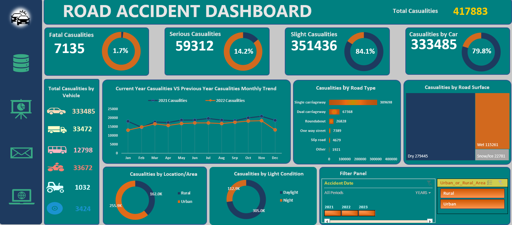
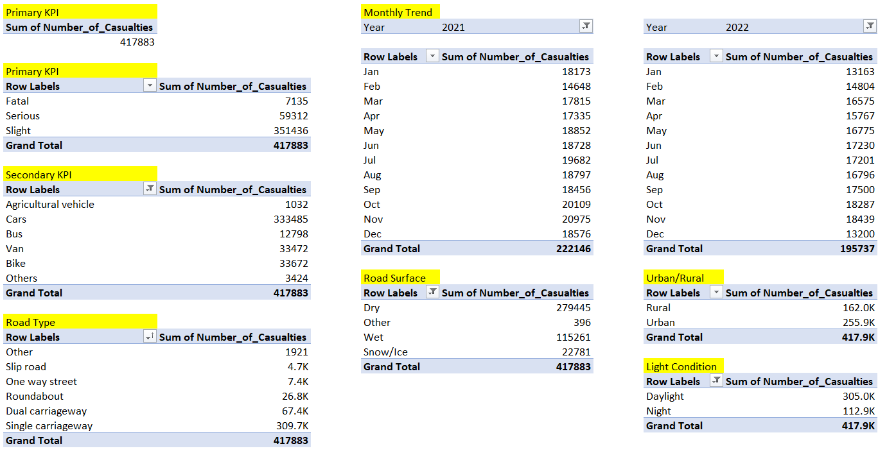

# Road Accident Dashboard

An Excel-based data analysis project focused on road accident data for 2021 and 2022. This project covers the entire analytics workflow—from requirement gathering, through data cleaning and processing, to visualization and interactive dashboard creation—aimed at delivering actionable insights for transport stakeholders.

---

## Project Overview

Developed an interactive Excel dashboard analyzing a large road accident dataset containing over 3 million records and 21 fields. The project covers data cleaning, processing, and advanced analysis to reveal key insights on accident severity, casualty trends, causes, and other important metrics. This dashboard empowers transport stakeholders to explore the data dynamically and make informed decisions to enhance road safety.

---

## Project Workflow 

1. **Requirement Gathering** – Collecting client needs and defining project scope.  
2. **Stakeholder Identification** – Recognizing all involved or affected parties.  
3. **Data Cleaning** – Preparing raw data for analysis by handling inconsistencies.  
4. **Data Processing** – Creating custom columns and calculated fields.  
5. **Data Analysis** – Leveraging PivotTables and Excel functions for insights.  
6. **Data Visualization** – Developing charts and dashboards to visualize results.  
7. **Dashboard Creation** – Compiling analyses into a user-friendly report/dashboard.

---

## Client Requirements

The dashboard focuses on accident data for 2021 and 2022, with KPIs including:

### Primary KPIs
- Total casualties after accidents.  
- Casualties and percentage breakdown by accident severity and by type of people affected.

### Secondary KPIs
- Casualties by vehicle type.  
- Monthly casualty trends comparing current and previous years.  
- Maximum casualties by road type.  
- Casualty distribution by road surface.  
- Casualties by area (urban/rural) and time (day/night).

---

## Stakeholders

The project serves the following stakeholders:

- Ministry of Transport  
- Road Transport Department  
- Police Force  
- Emergency Services Department  
- Road Safety Corps  
- Transport Operators  
- Traffic Management Agencies  
- General Public  
- Media Organizations  

---

## Tools & Features Used

- Microsoft Excel  
- Pivot Tables  
- Excel Formulas & Functions  
- Interactive Charts & Graphs  
- Conditional Formatting  
- Slicers and Filters for dynamic analysis  

---

## Project Structure

road-accident-dashboard/
├── README.md
├── Road_Accident_Dashboard.xlsx
├── assets/
│ ├── dashboard_screenshot.png
│ └── pivot_table_sample.png

---

---

## Screenshots

**Dashboard Overview**

**Pivot Table Example**

